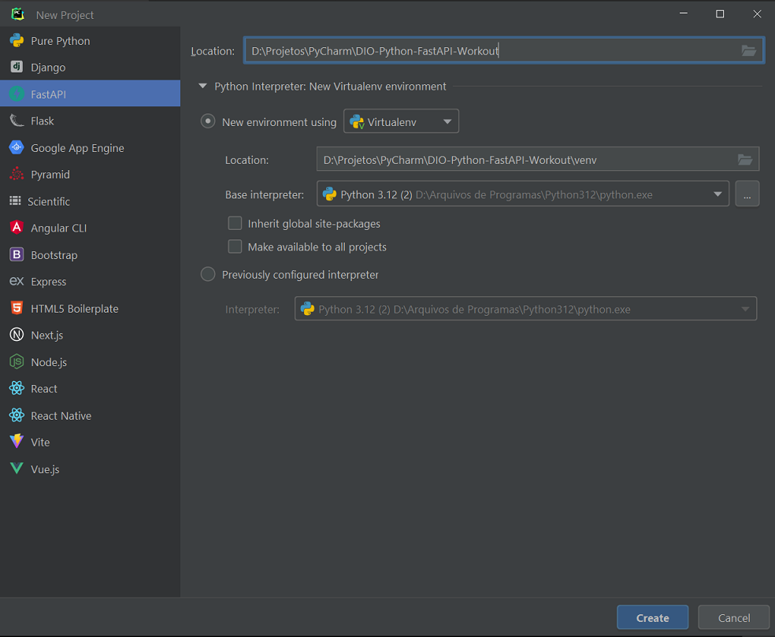
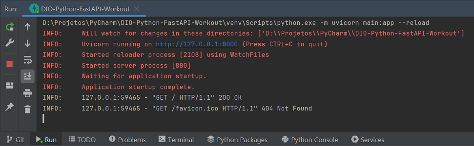
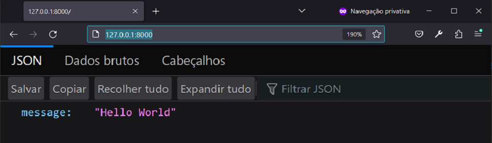

# DIO - Python - FastAPI - Workout
Project "Developing your First API with FastAPI, Python and Docker" by DIO.


## Development steps
The project development steps were:

1. Create project (in PyCharm):



2. Run the application and open the browser at `http://127.0.0.1:8000/`:





3. Check if the dependencies `fastapi`, `uvicorn`, `sqlalchemy` and `pydantic` are in `requirements.txt`.

4. Create `contrib` package with the files:
- `__init__.py`;
- `schemas.py` which implements the `BaseSchema` class:

```python
from pydantic import BaseModel

class BaseSchema(BaseModel):
    class Config:
        extra = 'forbid'
        from_attributes=True
```

- `models.py` which implements the `BaseModel` class:

```python
from uuid import uuid4
from sqlalchemy import UUID
from sqlalchemy.orm import DeclarativeBase, Mapped, mapped_column
from sqlalchemy.dialects.postgresql import UUID as PG_UUID


class BaseModel(DeclarativeBase):
    id: Mapped[UUID] = mapped_column(PG_UUID(as_uuid=True), default=uuid4, nullable=False)
```

Note: The classes in other packages will inherit from the classes in the corresponding files in the contrib package.


## References
DIO - Desenvolvendo sua Primeira API com FastAPI, Python e Docker:
https://web.dio.me/lab/desenvolvendo-uma-api-assincrona-com-fastapi/learning/4058b4b5-1716-43fb-9bf6-121139c16227

FastAPI - Documentation:
https://fastapi.tiangolo.com/